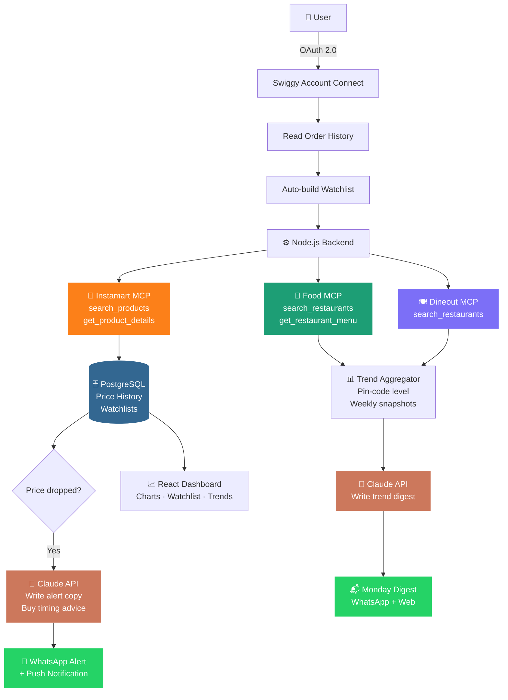

<div align="center">


<br/>

<a href="#"></a>
<a href="#"></a>
<a href="#"></a>
<a href="#"></a>

<br/><br/>


&nbsp;

&nbsp;


<br/><br/>

### *Swiggy has the data. None of it reaches the user.*
### *Nazar changes that.*

<br/>

</div>

---

<br/>

## 🤔 The Problem

Every Indian household buys the same groceries on Instamart every week. Prices shift daily. Swiggy runs a **Mega Savings Festival with up to 60% off** on the first 3 days of every month. New restaurants open in your neighbourhood and start trending before anyone notices.

**Swiggy surfaces none of this.** No alert. No price history. No trend feed. Nothing.

<br/>

> 💬 *"Swiggy does not have a price drop alert function. Users have to track prices manually — open the app, search for the item, write down the price in a notebook."*
>
> — NewsBytesApp, January 2025

<br/>

The workaround people use in 2025 is a **notebook.**

That is the gap. **Nazar fills it.**

<br/>

---

<br/>

## 👁️ What Nazar Does

<br/>

<div align="center">

### ╔══════════════════════════════╗
### ║  &nbsp;&nbsp;&nbsp;PART 1 · PRICE WATCHER&nbsp;&nbsp;&nbsp;  ║
### ╚══════════════════════════════╝

</div>

<br/>

Nazar connects to a user's Swiggy account, reads their Instamart order history, and **automatically starts tracking prices** for everything they regularly buy — atta, dal, tel, sugar. No setup. No typing item names.

The moment a price drops, or the Mega Sale is 24 hours away — the user gets a WhatsApp message.

<br/>

```
╔─────────────────────────────────────────────────────────╗
│  👁️  Nazar  ·  Price Alert  ·  7:42 AM                  │
├─────────────────────────────────────────────────────────┤
│                                                         │
│   Fortune Sunflower Oil 1L                              │
│   ₹152  ──────────────►  ₹134   ↓ ₹18  (12% off)       │
│                                                         │
│   📊  Lowest price in the last 6 weeks                  │
│   ⏰  Mega Sale ends in 14 hours                        │
│                                                         │
│   ╔═══════════════════════════╗                         │
│   ║   Order on Instamart  →   ║                         │
│   ╚═══════════════════════════╝                         │
╚─────────────────────────────────────────────────────────╝
```

<br/>

| ✦ | Feature | What it does |
|---|---|---|
| 📋 | **Auto Watchlist** | Built instantly from your order history — zero manual setup |
| 📈 | **Price History** | 30 / 60 / 90 day price chart for every tracked item |
| 🔔 | **Drop Alerts** | WhatsApp + push the moment price crosses your threshold |
| 🗓️ | **Mega Sale Reminder** | Auto-scheduled alert 24hrs before Day 1–3 every month |
| 🧠 | **Smart Buy Timing** | AI reads each item's price pattern — tells you when it's historically cheapest |
| ⚖️ | **Cross-Platform Compare** | Same item's price trend on Instamart vs Blinkit vs Zepto |
| ⚡ | **One-Tap Order** | Alert fires → tap → Instamart cart pre-loaded. Done. |

<br/>

---

<br/>

<div align="center">

### ╔════════════════════════════════╗
### ║  PART 2 · HYPERLOCAL TRENDS  ║
### ╚════════════════════════════════╝

</div>

<br/>

Swiggy publishes one national report a year. Biryani is #1 — for 10 years running. We know.

What nobody shows you: **what your specific neighbourhood is ordering right now, this week** — which dishes are quietly surging, which new restaurants are gaining traction before everyone else discovers them.

<br/>

```
╔─────────────────────────────────────────────────────────╗
│  👁️  Nazar  ·  Your Area This Week                      │
│  📍  Kalawad Road, Rajkot                                │
├─────────────────────────────────────────────────────────┤
│                                                         │
│  🔥  Trending This Week                                 │
│  ├─  Pav Bhaji ·········· ↑ 34%  (3 restaurants)       │
│  ├─  Cold Coffee ········ ↑ 41%  (post-3pm orders)      │
│  └─  Paneer Tikka ······· ↑ 28%  (new cloud kitchen)   │
│                                                         │
│  🆕  New & Already Rising                               │
│  └─  Grill House · Opened 12 days ago · Growing fast    │
│                                                         │
│  📬  Next digest: Monday 8 AM                           │
╚─────────────────────────────────────────────────────────╝
```

<br/>

| ✦ | Feature | What it does |
|---|---|---|
| 📍 | **Neighbourhood Trends** | Dishes + restaurants gaining order velocity in your exact pin code |
| 🆕 | **Early Signal** | New restaurants trending before they're on anyone's radar |
| 🍽️ | **Dish-Level Data** | Not just "restaurant is popular" — specifically which dish is surging |
| 📬 | **Weekly Digest** | Clean WhatsApp summary every Monday 8 AM |
| ✍️ | **AI Summaries** | Claude turns raw order signals into human-readable trend cards |

<br/>

---

<br/>

## 🏗️ Architecture

<br/>



<br/>

---

<br/>

## 🔌 MCP Integration

<br/>

| MCP Server | Tool | Powers |
|---|---|---|
| **Instamart** | `search_products` | Find user's tracked items by name + variant |
| **Instamart** | `get_product_details` | Current price, MRP, discount %, availability |
| **Food** | `search_restaurants` | Restaurant lookup by pin code for trend tracking |
| **Food** | `get_restaurant_menu` | Dish-level signal — which dishes are being ordered |
| **Dineout** | `search_restaurants` | Venue trends by neighbourhood |

<br/>

> **Auth:** Swiggy OAuth 2.0. User connects their account once. Nazar reads order history to build the watchlist automatically. No manual item entry ever required.

<br/>

---

<br/>

## 🔍 Why This Gap Exists

<br/>

| Product | What it does | Why it falls short |
|---|---|---|
| MetricsCart / 42Signals | Instamart price tracking | B2B — for Amul tracking their own shelf price. Enterprise cost. Not consumer. |
| Savvio / Quick Compare | Instamart vs Blinkit today | Point-in-time only. No history. No alerts. No pattern detection. |
| Keepa / CamelCamelCamel | Amazon India price history | Excellent product — zero Instamart coverage. Groceries aren't on Amazon. |
| Swiggy app itself | Everything | No price history. No watchlist. No alerts. Confirmed absent feature. |
| Zomato Trends | Restaurant demand data | Built for restaurant operators. City-level only. Not consumer-facing. |
| Swiggy annual report | National food data | Once a year. National scale. Not your neighbourhood, not this week. |

<br/>

**Keepa for Amazon is a product millions of people rely on daily. Nazar is Keepa for Instamart — plus hyperlocal food intelligence. This combination does not exist anywhere in India.**

<br/>

---

<br/>

## 🛠️ Tech Stack

<br/>

<div align="center">

| Layer | Technology |
|:---:|:---:|
| **Frontend** | React · TypeScript · Recharts |
| **Backend** | Node.js · Express · BullMQ |
| **Database** | PostgreSQL · Redis |
| **AI** | Claude API (Anthropic) |
| **Alerts** | WhatsApp Business API · Web Push |
| **Auth** | Swiggy OAuth 2.0 via MCP |
| **Infra** | Railway · Vercel |

</div>

<br/>

---

<br/>

## 🗓️ Roadmap

<br/>

```
v1  ·  Core ──────────────────────────────────────── Month 1 – 2
        ✦  Auto watchlist from Instamart order history
        ✦  Price history chart (30 days)
        ✦  WhatsApp drop alerts
        ✦  Mega Sale Festival monthly reminder

v2  ·  Intelligence ───────────────────────────────── Month 3 – 4
        ✦  60 / 90 day price history + smart buy timing
        ✦  Cross-platform price comparison
        ✦  Hyperlocal trend finder — weekly digest by pin code
        ✦  New restaurant early signal detection

v3  ·  Scale ──────────────────────────────────────── Month 5 – 6
        ✦  React Native mobile app
        ✦  Shareable neighbourhood trend reports
        ✦  Household mode — shared family watchlist
        ✦  Price alert forwarding to WhatsApp groups
```

<br/>

---

<br/>

<div align="center">


</div>
